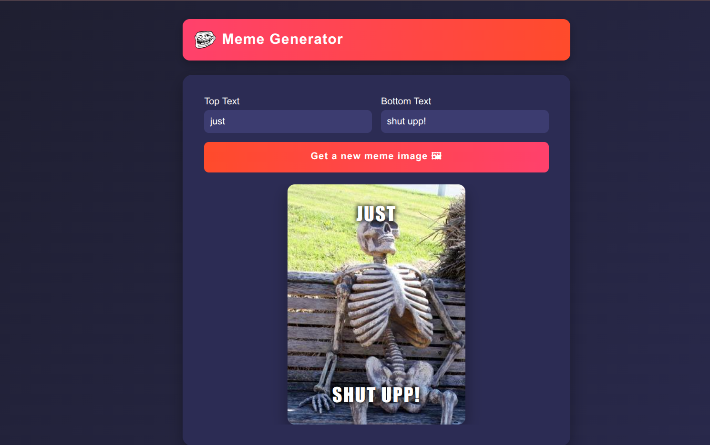

# 🎭 Meme Generator

Meme Generator is an interactive React app built with Vite that allows users to generate random memes, customize top and bottom text, and create shareable memes instantly. Fully responsive with a modern, vibrant UI, perfect for fun and practice with React concepts like state, props, and event handling.

---

## 🚀 Features
- 🎨 Generate random meme images
- ✍️ Add custom top & bottom text
- 📱 Responsive design (works on mobile & desktop)
- ⚡ Built with Vite for fast development
- 🌈 Styled with modern CSS

---

## 🌍 Live Demo
👉 [Click here to try the app!](https://Shivang14d04.github.io/Meme-Generator/)  

---

## 📸 Screenshot
### Home Page

---

## 🛠️ Tech Stack
- [React](https://reactjs.org/) ⚛️
- [Vite](https://vitejs.dev/) ⚡
- [JavaScript (ES6+)](https://developer.mozilla.org/en-US/docs/Web/JavaScript)
- [CSS3](https://developer.mozilla.org/en-US/docs/Web/CSS)

---

